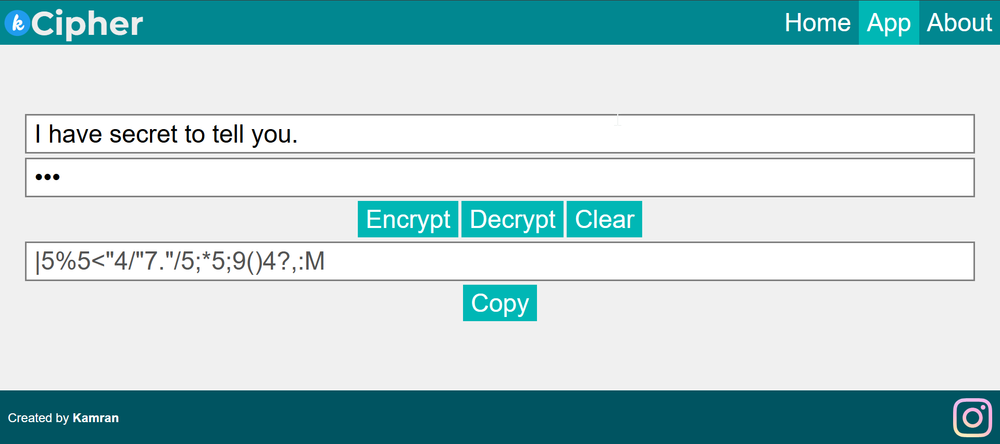
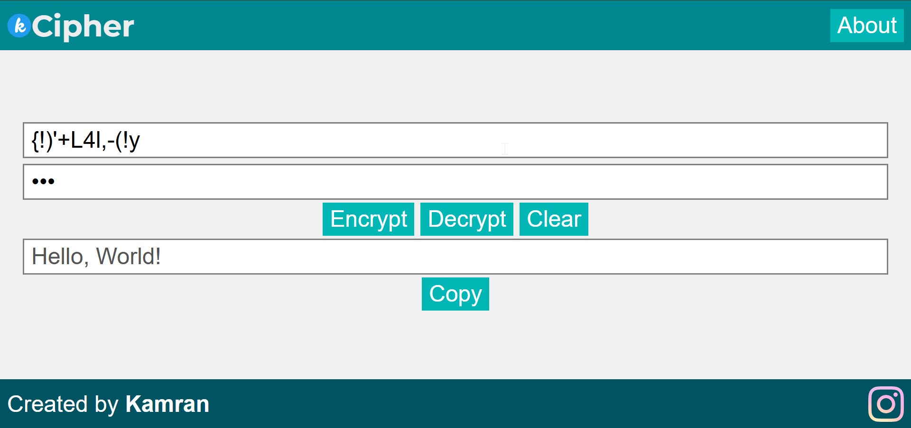

# 🔐 K-Cipher-Web

**K-Cipher-Web** is written in JavaScript. It is the web version of [k-cipher](https://github.com/realmkdev/k-cipher) which is originally written in Python.

---

## 🚀 Features
- Encrypt and decrypt any text using a custom key.
- Works with letters, numbers, symbols, and spaces.
- Fully written in pure JavaScript (only runs on front-end).

---

## 🧠 How It Works

The cipher shifts each character in your text based on:
- Its position in a predefined list of characters.
- The corresponding character in your password.
- The password length.

This makes it slightly stronger than a basic Caesar cipher, as it combines the text and key dynamically.

---

## 🧩 Usage
No installation required, just visit the website: [K Cipher](https://realmkdev.github.io/k-cipher-web/)

### Screenshots
Encryption:

Decryption:

---

## 🧑‍💻 Author

[**Muhammad Kamran**](https://github.com/realmkdev)

💡 Simple ideas, secure results.

---

## ⭐ Support

If you like this project, give it a star on GitHub ⭐ to show your support!
